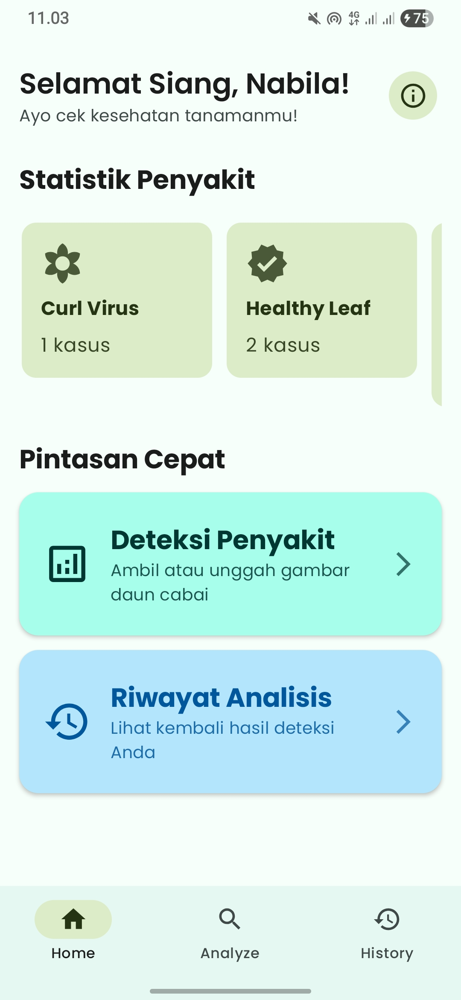
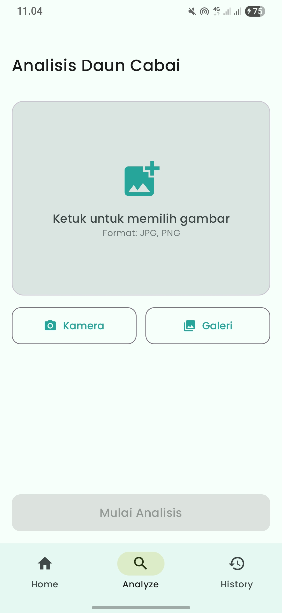

<p align="center">
  
</p>

<h1 align="center">Trawang Tani</h1>

<p align="center">
  An Android application to detect diseases on chili leaves using Machine Learning.
</p>

<p align="center">
  
  
  
</p>

---

## 🌶️ About The App

**Chili Leaf Detection App** is a mobile-based solution developed as an undergraduate thesis project. This application helps farmers and gardening enthusiasts to easily identify potential diseases on chili plants just by using their phone's camera. By leveraging on-device Machine Learning, the app provides fast and accessible preliminary analysis.

### ✨ Key Features

* **📸 Real-time Camera Detection:** Directly point your camera at a chili leaf to start detection.
* **🖼️ Upload from Gallery:** Analyze images of leaves that you have already taken.
* **💡 Disease Identification:** Identifies several common types of chili leaf diseases.
* **📖 Detection History:** Saves a log of all previous scans for your records.
* **ℹ️ Disease Information:** Provides brief information about the detected disease.

## 📱 Screenshots

<p align="center">
  
   &nbsp;&nbsp;&nbsp;&nbsp;&nbsp;
  
   &nbsp;&nbsp;&nbsp;&nbsp;&nbsp;
  
</p>


## 🛠️ Tech Stack & Tools

This project is built using modern Android development technologies:

* **Language:** [Kotlin](https://kotlinlang.org/)
* **UI:** [Jetpack Compose](https://developer.android.com/jetpack/compose)
* **Architecture:** MVVM (Model-View-ViewModel)
* **Machine Learning:** [TensorFlow Lite](https://www.tensorflow.org/lite)
* **Local Database:** [Room](https://developer.android.com/training/data-storage/room)
* **Asynchronous:** [Kotlin Coroutines](https://kotlinlang.org/docs/coroutines-overview.html)

## 🚀 How To Run

To get a local copy up and running, follow these simple steps.

**Prerequisites:**
* Android Studio Iguana | 2023.2.1 or newer.
* Android SDK configured.

**Setup:**
1.  Clone the repository:
    ```sh
    git clone https://github.com/nabilanabila19/Trawang-Tani.git
    ```
2.  Open the project in Android Studio.
3.  Let Android Studio handle the Gradle sync.
4.  Run the app on an emulator or a physical Android device.

## 📄 License

This project is licensed under the MIT License - see the [LICENSE.md](LICENSE.md) file for details.

---
<p align="center">
Developed by Nabila 🌱
</p>
